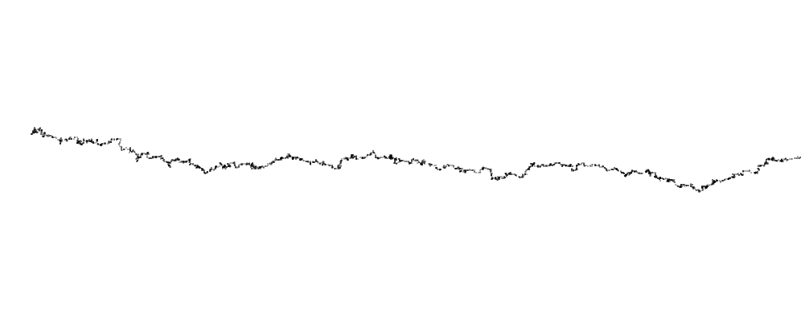
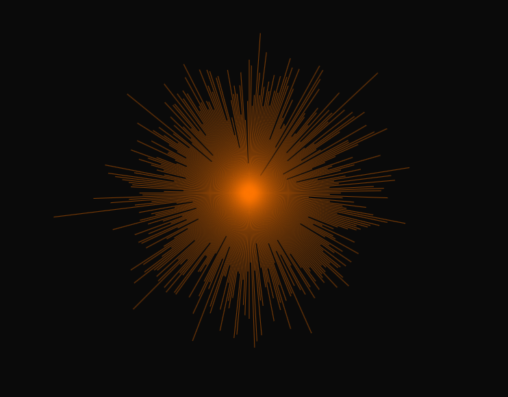
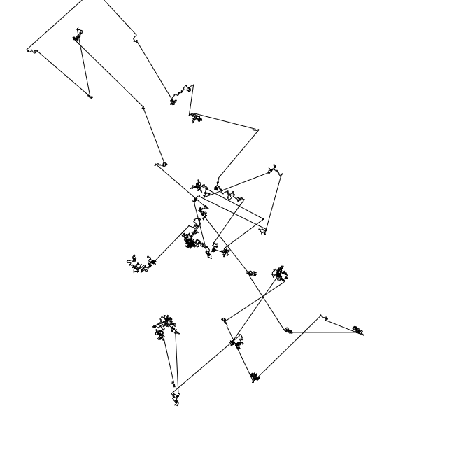
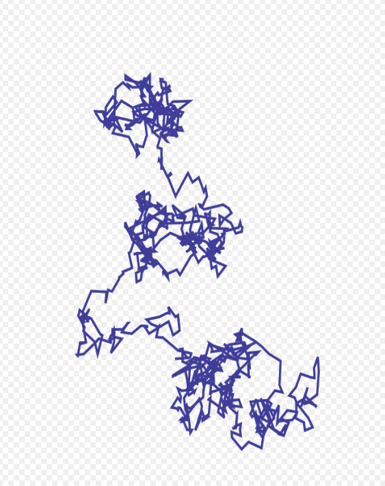

# 🌊 Unidad 1: Aleatoriedad y Procesos Estocásticos

**Texto Guia:** Capítulo 0 de _[The Nature of Code](https://natureofcode.com/random/#a-custom-distribution-of-random-numbers)_  
**Herramienta de desarrollo:** p5.js / JavaScript

---

## 📌 Actividad 01: Recursos y Reflexión

En esta primera actividad analizamos los fundamentos conceptuales de la aleatoriedad como motor generativo, entendiendo cómo el azar controlado permite transformar algoritmos rígidos en sistemas dinámicos con variabilidad y expresividad orgánica.

### 🔗 Enlaces de Investigación (Videos y Artículos)

- 📹 [Generative Art Exploration Chapter I Tracing the Roots: The History of Generative Art](https://youtu.be/d2LC6Am9bZI?si=ZMCtqfj6d7sjawNG).
- 📹 [How To Draw With Code | Casey Reas](https://youtu.be/_8DMEHxOLQE?si=4cFWE6rLkQYnftw9)
- 📹 [Artist Spotlight | Who is Refik Anadol?](https://youtu.be/zBYVm2wYzDU?si=0Bbvi2IT_zMSjrmq)
- 📹 [Discover Generative Artist Tyler Hobbs | AOI](https://youtu.be/8tTGJvijoDw?si=SSOmFDoxDmHtEjQL)
- 📄 [Randomness in the Composition of Artwork](https://www.tylerxhobbs.com/words/randomness-in-the-composition-of-artwork)
- 📄 [Probability Distributions for Algorithmic Artists](https://www.tylerxhobbs.com/words/probability-distributions-for-algorithmic-artists)
- 📄 [A Randomized Approach to Circle Packing](https://www.tylerxhobbs.com/words/a-randomized-approach-to-circle-packing)

### 💭 Mi Reflexión: El Control Estético a través de la Aleatoriedad

Una de las bases del arte generativo es la **aleatoriedad**; es la manera en que los artistas pueden multiplicar sus posibilidades, siendo esta una parte fundamental del proceso de creación. Al definir reglas alrededor de esta aleatoriedad, podemos cambiar el comportamiento y la aparición de las imágenes que queremos mostrar. Esto nos asegura que cada vez que ejecutemos el programa, el resultado será diferente al anterior, aportando una sensación de sorpresa y frescura.

Esta técnica es profundamente versátil y se puede aplicar a diversos atributos visuales:

- **Color:** Variación de paletas, saturación y opacidad.
- **Movimiento:** Vectores de dirección y velocidades variables.
- **Forma y Geometría:** poligonos, escalas y densidades.

Se trata de un proceso interactivo y experimental que inicia a partir de una idea abstracta, la cual exploramos, traducimos a un algoritmo y sometemos a diferentes combinaciones. En palabras simples **el arte generativo es el proceso de generar arte a través del código, donde la aleatoriedad vive en la composición y se manifiesta en los detalles**. No es un azar caótico e incontrolable: controlamos cómo se comporta la aleatoriedad a través de la **probabilidad**, logrando exactamente los efectos estéticos que deseamos comunicarle al espectador.

### 📊 Exploración de Distribuciones Probabilísticas

| Tipo de Distribución            | Comportamiento Teórico                                                                                                                                                              | Aplicación Estética y Algorítmica                                                                                                                                                                   |
| :------------------------------ | :---------------------------------------------------------------------------------------------------------------------------------------------------------------------------------- | :-------------------------------------------------------------------------------------------------------------------------------------------------------------------------------------------------- |
| **1. Distribución Uniforme**    | Tiene exactamente la misma probabilidad de elegir cualquier número dentro de un rango determinado.                                                                                  | Es la más flexible y general en los lenguajes de programación (ej. `random()`). Se distribuye de manera homogénea y plana sobre un área o intervalo.                                                |
| **2. Distribución Gaussiana**   | A diferencia de la uniforme, prevalecen con altísima probabilidad los números cercanos a la media ($\mu$), disminuyendo hacia los extremos según la desviación estándar ($\sigma$). | Es extremadamente útil para aproximar valores que queremos que sean similares entre sí (como tamaños en la naturaleza o agrupación de entidades), pero conservando variaciones orgánicas realistas. |
| **3. Ley de Potencia (Pareto)** | Parte de un valor mínimo donde se concentra la mayor probabilidad, y esta disminuye exponencialmente a medida que el número aumenta.                                                | Perfecta para generar fenómenos donde "lo pequeño es común y lo gigantesco es raro" (ej. Vuelos de Lévy), creando trayectorias con muchos pasos cortos locales y saltos largos sorpresivos.         |

---

## 📌 Actividad 02: Caminatas aleatorias

- [A Traditional Random Walk](https://natureofcode.com/random/#example-01-a-traditional-random-walk).
- [Actividad2](./Actividad_2.js)

### 🔍 Análisis del Código

Al evaluar la estructura del algoritmo de caminata aleatoria, podemos dividir el sistema en dos componentes fundamentales: el **Ciclo de Vida del Programa** y la **Clase Walker**.

#### 1. Ciclo de Vida del Programa (p5.js)

El flujo de ejecución del programa se rige por dos funciones principales:

- **`setup()` (Estado Inicial):** Se ejecuta una única vez al iniciar el programa. Su responsabilidad es preparar el entorno de simulación (crear el lienzo o _canvas_) e instanciar los objetos principales. Es el punto donde nace nuestra simulación.
- **`draw()` (Bucle de Tiempo / Integración):** Se llama de forma continua y repetitiva en cada cuadro (_frame_). Es el corazón de la animación y el encargado de recibir _inputs_ del usuario. En nuestra simulación, gestiona en cada ciclo a los métodos del objeto para actualizar su estado y presentarlo en pantalla.

#### 2. Modelado de la Clase `Walker`

Para encapsular el comportamiento del agente, utilizamos una clase llamada `Walker`, la cual cuanta con dos métodos principales:

- **`show()`:** Encargado estrictamente del renderizado visual; dibuja la posición actual del caminante en el lienzo.
- **`step()`:** Contiene la lógica matemática de movimiento y avance. En lugar de seguir una trayectoria determinista, opera de forma estocástica utilizando la función `random(4)`.

#### 3. Lógica de movimiento ($\Delta t$)

Dentro del método `step()`, la evaluación de `random(4)` genera una distribución uniforme que toma valores enteros y las condicionales dividen el espacio en 4 direcciones posibles:

1. **Arriba** ($y -= \text{paso}$)
2. **Abajo** ($y += \text{paso}$)
3. **Izquierda** ($x -= \text{paso}$)
4. **Derecha** ($x += \text{paso}$)

En la función `draw()`, al llamar secuencialmente a `walker.step()` y luego a `walker.show()`, estamos integrando numéricamente una trayectoria donde cada _frame_ representa un paso de tiempo discreto ($\Delta t$), permitiendo que el punto emerja y navegue caóticamente por la pantalla sin intervención externa.

---

## 📌 Actividad 03: Distribuciones de probabilidad

[randomGaussian](https://p5js.org/reference/p5/randomGaussian/)  
[Caminante con tendencia de moverse a la derecha - Codigo fuente](./Actividad_3.js)  
Para favorecer la caminata hacia la derecha se creo edito el metodo `step` de la clase `Walker` se agrego dos nuevas variables `let xstep = randomGaussian(0.5, 1.2)` y `let ystep = randomGaussian(0, 1.2)` para controlar su movimiento independientemente por ultimo se favorecio los valores mayores de 0 en el movimiento hacia la derecha ya que la media es 0.5 favorece la caminata

### 💭 Que es Distribucion uniforme y no uniforme en numeros aleatorios

La distribución uniforme es la que elige un número que tiene la misma probabilidad de salir en un rango, osea que de un rango de 1 al 10 todos tienen la misma probabilidad de ser elegidos, Mientras que en una distribución no uniforme se ve influenciada por un comportamiento para darle preferencia a un rango de números cercanos y baja la probabilidad de los otros números, por lo tanto es menos probable que elija un número en igualdad de condiciones

---

## 📌 Actividad 04: Distribución Normal

[ A Gaussian Distribution, The Nature of Code](https://natureofcode.com/random/#example-04-a-gaussian-distribution)  
[Distribucion normal - Codigo fuente](./Actividad_4.js)  
Para este ejercicio nos inspiramos de los rayos del sol, creamos un loop que recorre 360 numeros, en cada numero dibujamos una linea la cual rotamos un grado gracias al metodo `rotate()` y `radians()` usamos el metodo `randomGaussian()` para manipular la longitud de esta linea

---

## 📌 Actividad 05: Distribución personalizada: Lévy flight

[Lévy flight - The nature of code](https://natureofcode.com/random/#a-custom-distribution-of-random-numbers)  
[Lévy flight - wikipedia](https://en.wikipedia.org/wiki/L%C3%A9vy_flight)  
[Caminante + saltos de Lévy - Codigo fuente](./Actividad_5.js)  
El ejemplo seleccionado fue el Random Walk, ya que es un algoritmo que ya habiamos analizado y es facil de manipular debido a que el libro guia nos sugiere una variacion de este ejemplo considedre que es facil de implementar esperaba obtener un resultado parecido a la segunda imagen aunque no es similar me gusto el resultado final, cambiamos puntos por lineas y agregamos dos nuevas variables a nuestra clase para guardar las posiciones anteriores

---

## 📌 Actividad 06: Ruido Perlin
