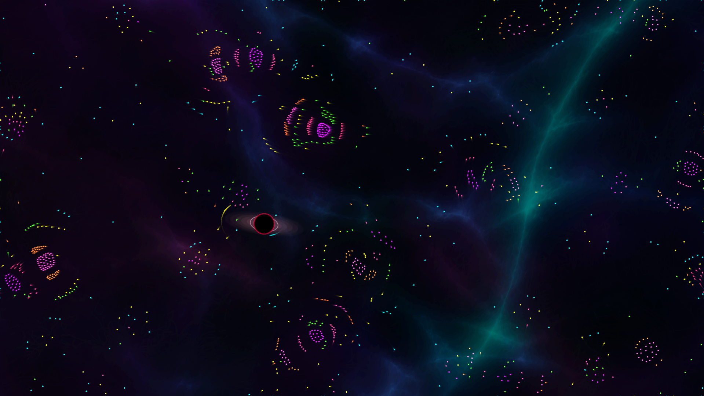
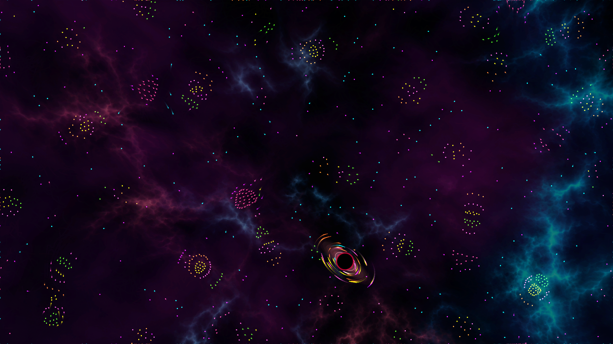
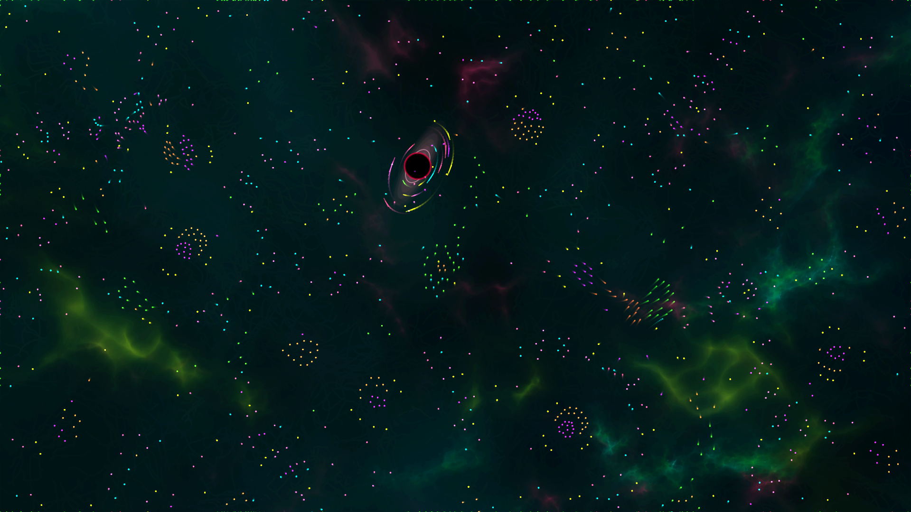

# 🌊 Unidad 2: Movimiento

**Texto Guia:** Capítulo 1 - Vectores de _[The Nature of Code](https://natureofcode.com/vectors/)_  
**Herramienta de desarrollo:** p5.js / JavaScript

---

## 📌 Actividad 01: Max Cooper

En esta seccion conocemos a Max Copper y lo usaremos como referente para nuestro reto de diseño un creativo en el arte generativo y simulaciones organicas lo tomamos como fuente de inspiracion y reconocemos su trabajo.

📹[Max Cooper - The Shape Of Memory (Official Video by Factory Fifteen)](https://youtu.be/oJzmamTmr8o?si=tZgCiT7f94vDheHe)
📹[Max Cooper - Order From Chaos (official video by Maxime Causeret)](https://youtu.be/_7wKjTf_RlI?si=z5YLYx2TxM86AWz_)
📄[Max Cooper - Web](https://maxcooper.net/)
📄[The Shape Of Memory](https://maxcooper.net/the-shape-of-memory)

## 📌 Actividad 02: Motion 101

Este algoritmo nos proporciona los fundamentos para desarrollar los conceptos de nuestro reto de diseño el concepto principal es como se simula el movimiento para esto debemos manipular vectores entonces dare una deficion de lo que yo considero que es un vector, podemos definir un vector como una flecha la cual tiene una longitud y un angulo que define la direccion en un espacio 2d/3d, ahora hablemos de movimiento podemos usar 3 vectores, **posicion**, **velocidad** y **aceleraccion**, para mover nuestro objeto.

- **Vector posicion:** Se encarga de la cordenada del objeto en el lienzo respecto al frame
- **Vector velocidad:** Controla la frecuencia de cambio de la posicion con respecto a los frame, aqui es cuando sumamos los vectores y agregamos rapidez y direccion
- **Vector aceleracion:** Controla la tasa de cambio de la velocidad (que tan rapido aumenta o baja la velocidad de un objeto)

## 📌 Actividad 03: Particle life

El algoritmo particle of life creado por Tom Mohr donde manipulamos particulas a traves de reglas matematicas de atraccion y repulsion, definamos entonces que es una particula en palabras simples una particula es la cantidad mas pequeña de materia que conserva propiedades fisicas, tamaño, densidad entre otros, este algoritmo usa como referente otro trabajo el cual tambien reconocemos Clusters, el sistema de partículas asimétrico con patrones emergentes creado por Jeffrey Ventrella.

- 📄[Clusters](https://www.ventrella.com/Clusters/)
- 📄[Intro to Clusters](https://www.ventrella.com/Clusters/intro.html)
- 📹[Clusters - an Asymmetrifcal Particle System with Emergent Patterns](https://vimeo.com/1048238799?fl=pl&fe=sh)
- 📹[How Particle Life emerges from simplicity](https://youtu.be/p4YirERTVF0?si=w6W8ixkeWjB6t_Nj)
- 📹[The code behind Particle Life](https://youtu.be/scvuli-zcRc?si=J35TK9NATgrFfli3)
- 🚀[Aplicacion Particle life - Java](https://github.com/tom-mohr/particle-life-app)
- 🚀[Sandbox - Particle life](https://sandbox-science.com/particle-life)

## 📌 Actividad 04: Diseño Generativo

Vamos a responder las siguientes preguntas pero antes de eso definamos que es diseño generativo; Es una tecnica donde el artista usa un sistema apoyado de tecnologia para crear diseños diferentes sin tener que intervenir varias veces en el para cambiar el resultado final **Patrik Hübner** define las siguientes caracteristicas para el sistema generativo:

- **Conjunto de reglas** Un sistema generativo esta basado en un algoritmo (una receta de pasos para elaborar un proceso que tiene principio y tiene fin). Estas reglas son las bases del proceso generativo y el resultado de diseño
- **Autonomia** Abstraer la idea original, como un conjunto de reglas e implementar estas reglas en un programa, el desarrollador automatiza el proceso de diseño y le da el sistema generativo cierto grado de independencia
- **Movement** Un sistema generativo es capaz de producir un numero de resultados infinitos, este movimiento se da en el proceso y el resultado del proceso generativo puede ser rigido.
- **Completo** Cuando un sistema generativo empieza a moverse, puede actuar autónomamente y produce un resultado, entonces se considera completo por que no es dependiente.

📄[What is Generative Design?](https://www.patrik-huebner.com/datadesigndictionary/generative-design/)

### 1. Intención: ¿Qué transformación, sensación, tensión o idea debe experimentar quien observa?

El que observa debe sentir curiosidad y calma, debe pasar de ser un espectador pasivo ha un generador de fuerzas, que pueda ser protagonista de su propio caos

### 2. Entidades: ¿Qué elementos existen? Partículas, especies, campos, fronteras, memorias o señales.

- **Particle Life** Existen 7 especies de particulas que constantemente cambian sus reglas de atraccion y repulsion se rigen a traves de reglas asimetricas, son la parte micro de esta experiencia
- **Attractor** Es la masa super densa que cambia las reglas de las especies de las particulas atrayendolas deformando la convivencia entre ellas

### 3. Relaciones: ¿Cómo se afectan? Atracción, repulsión, persecución, cooperación, competencia o indiferencia.

La interaccion de los **Atractors** desatan el caos se pueden mover por el espacio, atrapando estas particulas, cambiando tu tamaño entre mas grande mas atrapas pero si atrapas demasiadas estallaras como un quasar

### 4. Entradas: ¿Qué alimenta el sistema? Semilla, tiempo, audio, interacción, datos o decisiones del participante.

El sistema cambia con el tiempo cada minuto cambiamos las reglas de como estas 7 especies de particulas se atraen o repelen entre ellas, mientras hay un audio que lo acompaña el cual es relajante, y las desiciones del Atractor puede atrapar particulas y liberarlas donde hayan otras particulas diferentes y ver como reacciona al expulsarlas en ese lugar

### 5. Reglas: ¿Cómo cambia el estado de un frame al siguiente?

Cambia 60 FPS dependiendo de la especie dos particulas cercanas el motor pregunta que interaccion preestablecida debe ocurrir atraerse o repelerse.
El sistema lee los inputs del usuario y actualiza el espacio y masa del atractor.

### 6. Invariantes: ¿Qué debe permanecer para conservar la identidad del sistema?

La asimetria de las fuerzas entre particulas, El atractor como entidad masiva que deforma el espacio.

### 7. Variabilidad: ¿Qué puede ser diferente en cada ejecución sin destruir esa identidad?

Las reglas de attracion y repulsion entre especies de particulas, el cambio de background, la musica, las coordenadas, densidad y velocidad de los attractos, la cantidad de particulas que participan

### 8. Curaduría y reflexión: ¿Qué resultado es significativo y cuál es solo un accidente interesante?

Para mi es significativo cuando las particulas logran organizarse en una forma organica, que un attractor capture muchas particulas es un problema por que nos podria dejar sin particulas para interactuar entonces nacio quasar como solucion

## 📌 Actividad 05: Reto de Diseño

### Tension

Se explora el orden emergente autonomo de las 7 especies de las particulas y el control gravitacional forzado de los atractors. La contradicción reside en las reglas físicas: la materia quiere fluir libremente, pero la gravedad impuesta la somete. Las 1250 particulas buscan organizarce y el usuario irrumpe en este equilibrio, la tension escala hasta que no puede sostener mas masa y colapsa

Hay 1250 particulas, 1 Atractor, el alcance entre las 7 particulas es corto mientras que el del atractor es grande y se hace evidente la diferencia de fuerzas,la distribucion de las particulas es completamente aleatorio, mientras que la del atractor siempre es fija en el medio del lienzo, la cantidad de particulas siempre sera constante mientras que la matriz de interaccion de particulas muta cada 30 segundos, la apariencia es neon con fondos espaciales generados con ia

[demo web](https://campos-invisibles.vercel.app/)

**Controles de la Demo Web (Teclado):**

- **Movimiento:** Flechas direccionales (`→` `←` `↑` `↓`).
- **Masa:** Mantén presionada `Q` (Disminuir) o `E` (Aumentar) para ajustar la capacidad de absorción del atractor.
- **Explosión:** Barra `Espaciadora` para detonar manualmente la materia acumulada.

| Criterio                                                                          |   Peso   | Valoración | Aporte  |
| :-------------------------------------------------------------------------------- | :------: | :--------: | :-----: | --- | -------- | --- | --- |
| La intención es clara y perceptible en el comportamiento.                         |   20%    |    5.0     |   1.0   |
| Los tipos, cantidades, matriz y parámetros están justificados desde la intención. |   25%    |    5.0     |  1.25   |
| Comprendo y puedo modificar el funcionamiento técnico del sistema.                |   20%    |    5.0     |   1.0   |
| El sistema produce variaciones con una identidad reconocible.                     |   15%    |    5.0     |  0.75   |
| Experimenté, comparé, seleccioné y descarté con criterios claros.                 |   10%    |    5.0     |   0.5   |
| Puedo distinguir y sustentar lo diseñado y lo emergente.                          |   10%    |    5.0     |   0.5   |
| **Total**                                                                         | **100%** |            | **5.0** |     | **100%** |     |     |

