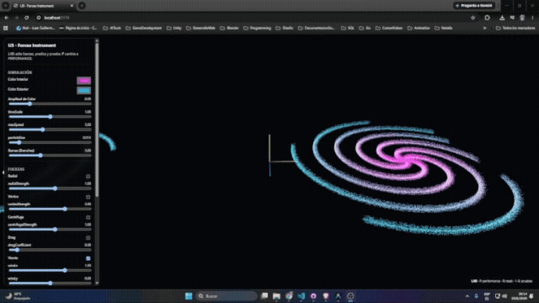

# 🌊 Unidad 3: Fuerzas

**Texto Guia:** Capítulo 2 - Vectores de \_[The Nature of Code](https://natureofcode.com/forces/)
**Herramienta de desarrollo:** three.js / JavaScript

El proposito de esta unidad es desarrollar un sistema dinamico que se pueda tocar en tiempo real.

### Pregunta Guia

**¿Cómo puede una persona interpretar una pieza musical mediante un sistema de partículas cuyo comportamiento surge de fuerzas que comprende, puede verificar y puede modificar?**

## 📌 Actividad 01: Referentes

### ¿Que parte es el sistema?

El sistema es el software, el algoritmo, las reglas fisicas que ordenan como se debe comportar los elementos dentro del entorno digital

### ¿Que parte es el instrumento?

Es la interfaz que permite tomar el control al usuario e interacturar con el sistema para generar un resultado diferente

### ¿Que parte se interpreta?

El audio se interpreta y estimula el sistema

### ¿Que parte emerge?

El resultado visual y sonoro, el cual se crea por la interaccion de las reglas definidas del sistema con los datos interpretados.

En esta actividad exploraremos referentes visuales, los cuales son utiles para ampliar nuestros recursos para desarrollar la pregunta de diseño.

- 📄[Robert Hodgin - particulas, simulacion, emergencia](https://roberthodgin.com/)
- 📄[lumicles - Sistema masivo de particulas](https://www.lumicles.xyz/)
- 📄[Scribble - Sistema Audiovisual](https://acg.media.mit.edu/people/golan/scribble/index.html)
- 📄[Magnetosphere - Robert Hodgin](https://roberthodgin.com/project/magnetosphere)
- 📄[Collider - Robert Hodgin](https://roberthodgin.com/project/collider)
- 📄[Akiko Nakayama - Arto Work](https://www.akikopainting.com/)
- 📹[Golan Levin on software as art](https://youtu.be/l7tm24x0hzA?si=5eFfBba8umXEKv7d)
- 📹[Magnetosphere - Robert Hodgin](https://vimeo.com/8581392?fl=pl&fe=sh)
- 📹[Mushroom](https://youtu.be/2TYPhw0QwLI?si=RdpgzoKhEbguCKcg)
- 📹[Floating Points - 'Key103' (Official Video)](https://youtu.be/DaiuHTYvF2U?si=ysGznewnq8DGFi5B)
- 📹[Storytelling of the Alive Painting ‘Bubble’](https://youtu.be/58Dd7VIwHBg?si=pblfnEfbeWMt9XwI)
- 📹[【Full】Alive Painting 2hours Solo 'GIFUKEI' exhibition at Tokyo University of the Arts](https://youtu.be/OWe6ORQLBBY?si=zT76Q6czAxGWX8Us)

## 📌 Actividad 02: Laboratorio de fuerzas

En este espacio aproveche para explorar la plantilla, e inspirarme con la cancion que estaba escuchando

- 📄[Caso de estudio](https://github.com/juanferfranco/forces-instrument-u3)

## 📌 Actividad 03: Encargo de Diseño

Interpretaremos esta pieza musical

- 📹[LesAlpx](https://music.youtube.com/watch?v=iuTk8x410mk&si=5uIiZlxhe_l92Fny)

Esta cancion me saca de mi mundo y me transporta a otro universo me da vibras de futurismo y progreso, El concepto que decidi tomar partes del synthwave y agregarlos a mi visualizador, las particulas les agregue una textura de estrella y las organice en forma de galaxia tambien añadi una mujer bailando la cual esta farmeando aura y tiene toques de holograma mientras giran alrededor una nave espacial

## 📌 Actividad 04: Presentacion

| Criterio                                      | Peso        | Qué debe demostrar la evidencia                                                                                                                                                                                                                                                                    | Valoración | Evidencia concreta                                                                                                                                                                                                                                   |
| --------------------------------------------- | ----------- | -------------------------------------------------------------------------------------------------------------------------------------------------------------------------------------------------------------------------------------------------------------------------------------------------- | ---------- | ---------------------------------------------------------------------------------------------------------------------------------------------------------------------------------------------------------------------------------------------------- |
| **Trazabilidad y comprensión del sistema**    | 25          | Puedo señalar y explicar estado, fuerzas, integración, render y controles; además puedo ubicar qué partes produjo o modificó la IA.                                                                                                                                                                | **22/25**  | Explicación detallada del funcionamiento de los compute shaders en WebGPU, los buffers de almacenamiento para las 131,072 partículas, la estructura modular de la simulación y la sincronización de las posiciones de las naves hacia la GPU.        |
| **Verificación del algoritmo de fuerzas**     | 25          | Estudié en detalle el proyecto y aunque no comprenda toda la sintaxis, puedo identificar su arquitectura, sus partes, puedo aislar una fuerza central, formular una predicción, la ejecuté ya analicé, comparé el resultado, cambié deliberadamente un signo o parámetro y expliqué la diferencia. | **22/25**  | Análisis y ajuste de las fuerzas de vórtice, viento, atracción/repulsión y la inversión oscilante aplicada en la influencia de las naves, verificando empíricamente su comportamiento en el enjambre.                                                |
| **Diseño de fuerzas e intención**             | 20          | Las fuerzas y sus parámetros hacen perceptible una intención; el comportamiento surge de la dinámica y no de trayectorias previamente dibujadas.                                                                                                                                                   | **17/20**  | Diseño de las órbitas dinámicas de las cuatro naves usando funciones trigonométricas combinadas, la interacción de campo local sobre las partículas y la onda de choque radial activada por clic.                                                    |
| **Instrumento, score e interpretación**       | 15          | El score conecta la escucha con decisiones; escogí pocos controles expresivos y puedo conducir el sistema en vivo sin que el audio lo controle automáticamente.                                                                                                                                    | **13/15**  | Uso del panel de control con estética Synthwave personalizado para modificar en tiempo real los parámetros físicos, la velocidad y los comportamientos del sistema de manera manual.                                                                 |
| **Experimentación y criterio frente a la IA** | 10          | Comparé alternativas, registré hallazgos y descartes, corregí propuestas de IA y puedo justificar por qué conservé la versión presentada.                                                                                                                                                          | **8/10**   | Iteraciones conjuntas sobre la integración de texturas PNG con alpha map, ajuste del grosor vertical de la galaxia mediante el parámetro scatterY, corrección de errores de sintaxis en TSL y optimización de escala y materiales de los modelos 3D. |
| **Entrega técnica y documentación**           | 5           | la URL pública abre; la bitácora permite verificar el proceso.                                                                                                                                                                                                                                     | **4/5**    | Estructuración limpia del proyecto bajo WebGPU, corrección de errores de bucle y correcta integración de iluminación, niebla volumétrica y rejilla de neón.                                                                                          |
| **Total**                                     | **100/100** |                                                                                                                                                                                                                                                                                                    | **4.3**    |                                                                                                                                                                                                                                                      |
