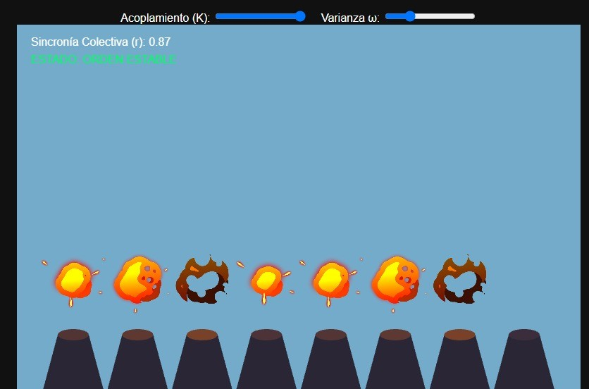
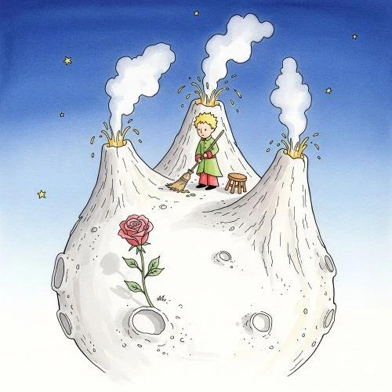
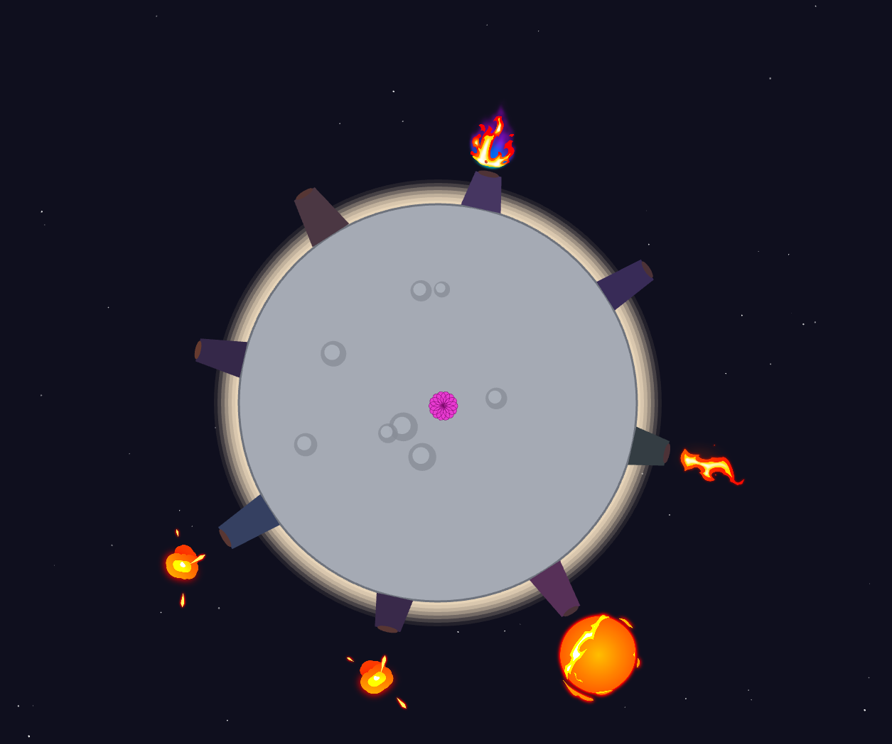

# 🌊 Unidad 4: Osciliación

**Texto Guia:** Capítulo 3 - Oscillation [The Nature of Code](https://natureofcode.com/oscillation/)
**Herramienta de desarrollo:** three.js / JavaScript

El proposito de esta es estudiar comportamientos periódicos y oscilatoriosortes. La unidad busca ampliar la comprensión del movimiento más allá del desplazamiento lineal y usarlo con fines expresivos.

## 📌 Actividad 01: Referentes

- 📹[¿Quien es Memo Akten?](https://memo.tv/)
- 📹[Simple Harmonic Motion](https://memo.tv/projects/2019/shm/)
- 📹[El Sorprendente Secreto de la Sincronización](https://youtu.be/BH85KeKpNQQ?si=h6HIY39J0m5mwDe7)
- 📹[Fireflies](https://ncase.me/fireflies/)
- 📹[Incredibox](https://www.incredibox.com/)
- 📹[Kuramoto Dreams](https://cgli.itch.io/kuramoto-dreams)

## 📌 Actividad 02: Encargo de diseño

### Concepto: Sincronía Tectónica

Sincronía tectónica en volcanes (o sincronía vulcanotectónica) se refiere al fenómeno en el cual múltiples volcanes o sistemas magmáticos entran en actividad, cambian su comportamiento o erosionan de forma simultánea debido a un mismo estímulo o esfuerzo tectónico regional, cada agente es un volcan que erupciona;

- **θi Es la presión acumulada**: la presión geotérmica del volcan, Al llegar al límite: erupciona y la presión se libera a 0.
- **ωi Frecuencia natural** nos indica que tan activo es el volcan, algunos volcanes entran en erupcion cada pocos segundos, otros son volcanes lentos
- **K Acoplamiento tectónico** la conexión entre los diferentes volcanes para producir una erupción conjunta

### Prototipo Inicial

### Inspiracion El principito

- En el cuento del principito el cuida los volcanes, se implementa una Mecánica de Limpieza con la tecla W, el usuario asume el rol del protagonista barriendo la superficie con chispas doradas para devolver el orden caótico y la independencia a los cráteres.
- La Rosa, representa la fragilidad, el cuidado y la singularidad que motivan la existencia del pequeño mundo
- Aislamiento Planetario, conecta el concepto de un planeta solitario en la inmensidad del espacio profundo con el modelo de Kuramoto. Sus 8 agentes reflejan cómo en un micromundo cerrado, cualquier perturbación local (como el terremoto tectónico con la barra espaciadora) repercute de manera inmediata e ineludible en todo el colectivo.

### Comportamiento

- **Volcan 0 y 7**: Con una frecuencia natural alta de $\pi \times 2.0$, emite un pulso percusivo rápido con el audio `kick_drum.mp3` y el spritesheet de erupción estándar
- **Volcán 1**: Configurado con una frecuencia de $\pi \times 1.0$, interpreta el sample rítmico `beatbox.mp3` vinculado visualmente al spritesheet de destello láser
- **Volcán 2**: Opera a una frecuencia de $\pi \times 0.5$, reproduciendo el sonido de alta frecuencia `hi-hat.mp3` acompañado por la animación de llama simple
- **Volcán 3**: Posee una frecuencia de $\pi \times 0.25$, emitiendo notas de percusión metálica mediante `triangle.mp3` y una llama con toques azules
- **Volcán 4**: Establecido en una frecuencia pausada de $\pi \times 0.15$, activa el sample de caja `snare.mp3` junto con el spritesheet de fuego normal
- **Volcán 5**: Cuenta con una frecuencia reducida de $\pi \times 0.1$, utilizando el sonido ambiental de sintetizador seco `dry_synth.mp3` y una columna de llama vertical
- **Volcán 6**: El agente más contemplativo, con una frecuencia casi estática de $\pi \times 0.05$, ejecuta un sintetizador melódico extendido `Riff_Synth.mp3` sincronizado con una esfera mágica cuya animación se mantiene en bucle estricto hasta finalizar el audio.

#### ¿Cómo convertir un modelo de autoorganización en un instrumento audiovisual performativo?

- Primero hay que traducir las variables invisibles del sistema matematico en dimensiones concretas como; sprites en bucles, activacion de audio ritmico, variacion de la atmosfera del planeta.
- Exponer los parametros estructurales del modelo a interfaces de interaccion, deslizadores de $K$ y $\omega$, comandos de teclado para terremotos tectónicos con SPACE o limpieza con W que transforman una simulación cerrada en un entorno ejecutable.

#### ¿Qué hace Kuramoto en esta experiencia que no podría resolverse simplemente mediante un reloj global, un secuenciador o temporizadores independientes?

- Kuramoto genera un comportamiento emergente y descentralizado, donde los volcanes ajustan sus frecuencias de manera orgánica al ser influenciados localmente por las fases de sus vecinos.

### [Enlace del Demo](https://editor.p5js.org/alafresh16/sketches/WWpB-B13U)

| Requisito Mínimo                                                | Estado     | Implementación en el Proyecto                                                                                                          | Calificación |
| --------------------------------------------------------------- | ---------- | -------------------------------------------------------------------------------------------------------------------------------------- | ------------ |
| **8 agentes simultáneos gobernados dinámicamente**              | ✅ Cumple  | Arreglo `agents` inicializado y gestionado con `totalAgents = 8` mediante el algoritmo iterativo.                                      | 5.0 / 5.0    |
| **4 personalidades audiovisuales diferentes**                   | ✅ Cumple  | Implementamos 7 personalidades con `i % 7`, asignando frecuencias _omega_, proporciones geométricas, sprites y audios únicos.          | 5.0 / 5.0    |
| **Manifestación visual y sonora vinculada al comportamiento**   | ✅ Cumple  | Lógica en `Agent.js`: el magma sube según la presión _theta_. Al cruzar 2π, detona el audio y el bucle dinámico del spritesheet.       | 5.0 / 5.0    |
| **Modificar 2 variables en tiempo real (K obligatorio)**        | ✅ Cumple  | Interfaz UI conectada para alterar el acoplamiento global (_K_) y la inyección de varianza/ruido de fase (_omega_).                    | 5.0 / 5.0    |
| **2 interacciones performativas (Global e Individual)**         | ⚠️ Parcial | **Global:** Teclas `SPACE` y `W` listas.  **Individual:** Falta crearr el clic/arrastre con el mouse sobre un cráter específico. | 2.5 / 5.0    |
| **Mecanismo de perturbación para alterar y observar respuesta** | ✅ Cumple  | Tecla `SPACE` (Terremoto) satura _K_ temporalmente; `W` inyecta entropía, forzando al sistema a renegociar su equilibrio.              | 5.0 / 5.0    |
| **Reconocer 3 estados (Desorden, Parcial, Estable)**            | ✅ Cumple  | Lógica matemática basada en el parámetro _r_: Desorden (_r_ < 0.3), Parcial (0.3 ≤ _r_ < 0.8) y Estable (_r_ ≥ 0.8).                   | 5.0 / 5.0    |
| **Forma perceptible de comunicar el estado colectivo**          | ✅ Cumple  | Halo atmosférico reactivo (azul frío → gris → rojo incandescente pulsante) y HUD de texto alternable con `H`.                          | 5.0 / 5.0    |

**Nota Final Estimada: 4.5 / 5.0**
