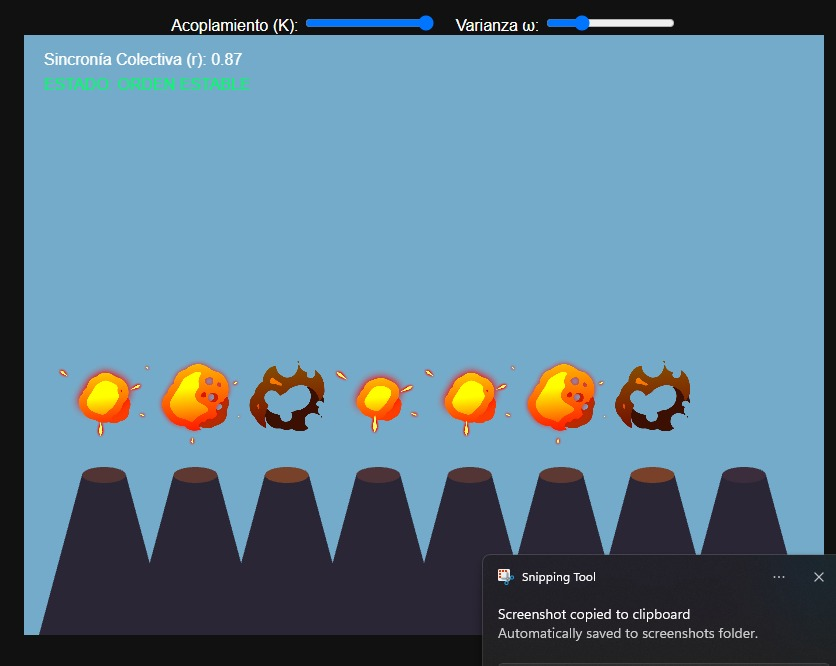
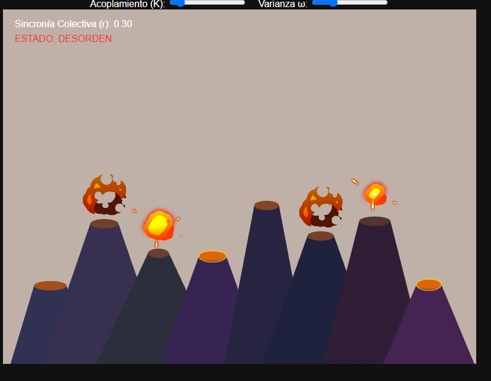

# 🌊 Unidad 4: Osciliación

**Texto Guia:** Capítulo 3 - Oscillation [The Nature of Code](https://natureofcode.com/oscillation/)
**Herramienta de desarrollo:** three.js / JavaScript

El proposito de esta es estudiar comportamientos periódicos y oscilatoriosortes. La unidad busca ampliar la comprensión del movimiento más allá del desplazamiento lineal y usarlo con fines expresivos.

## 📌 Actividad 01: Referentes

- 📹[¿Quien es Memo Akten?](https://memo.tv/)
- 📹[Simple Harmonic Motion](https://memo.tv/projects/2019/shm/)
- 📹[El Sorprendente Secreto de la Sincronización](https://youtu.be/BH85KeKpNQQ?si=h6HIY39J0m5mwDe7)
- 📹[Fireflies](https://ncase.me/fireflies/)
- 📹[Incredibox](https://www.incredibox.com/)
- 📹[Kuramoto Dreams](https://cgli.itch.io/kuramoto-dreams)

## 📌 Actividad 02: Encargo de diseño

### Concepto: Sincronía Tectónica

cada agente es un volcan que erupciona;

- **θi Es la presión acumulada**: la presión geotérmica del volcan, Al llegar al límite: erupciona y la presión se libera a 0.
-

¿Cómo convertir un modelo de autoorganización en un instrumento audiovisual performativo?

- Primero hay que traducir las variables invisibles del sistema matematico en dimensiones concretas como; sprites en bucles, activacion de audio ritmico, variacion de la atmosfera del planeta.
- Exponer los parametros estructurales del modelo a interfaces de interaccion, deslizadores de $K$ y $\omega$, comandos de teclado para terremotos tectónicos con SPACE o limpieza con W que transforman una simulación cerrada en un entorno ejecutable.  
  ¿Qué hace Kuramoto en esta experiencia que no podría resolverse simplemente mediante un reloj global, un secuenciador o temporizadores independientes?
- Kuramoto genera un comportamiento emergente y descentralizado, donde los volcanes ajustan sus frecuencias de manera orgánica al ser influenciados localmente por las fases de sus vecinos.
