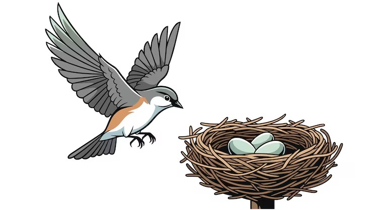
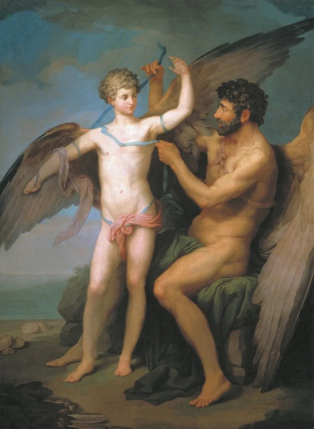

# 🌊 Unidad 5: Sistema de Particulas

**Texto Guia:** Capítulo 4 - Particle Systems [The Nature of Code](https://natureofcode.com/particles/)
**Herramienta de desarrollo:** three.js / JavaScript

Una partícula aislada puede moverse. Una relación hace posible una estructura. Una estructura que cambia puede convertirse en lenguaje.

## 📌 Actividad 01: Referentes

- 📹[Forms 2011](https://memo.tv/projects/2011/forms/)
- 📹[ForumTedTalk](https://github.com/juanferfranco/ForumTEDTALK)
- 📹[Propuesta de diseño - juanferfranco](https://juanferfranco.github.io/ForumTEDTALK/)
- 📹[Insumos cliente](https://drive.google.com/drive/folders/1DoaP6OaAYheK7p3QUW_QAkjCA0l2aVBO?usp=sharing)

## 📌 Actividad 02: Encargo de diseño

### Concepto: Huevo y aves, con eco a Ícaro y Dédalo

La estructura del sistema de particulas empieza como una masa cerrada y contenida "Un Huevo" demostrando el potencial; posteriormente se abre y se organiza en una silueta de un ave joven que es acompañada por un ave adulta la cual ya tiene su propia trayectoria, antes que el joven existiera.

Esta relacion evoca el mito de Ícaro y Dédalo, un vuelo enseñador por quien ya sabe volar, pero cambiamos el final, ambas generaciones terminan sosteniendose en el aire y ninguna cae, es la traduccion visual de "el crecimiento no ocurre cuando una generación reemplaza a otra, ocurre cuando trabajan juntas" existe una colaboracion sostenida.

| #   | Comportamiento de partículas                                                                                           | Representa (por qué no es decorativo ni literal)                                                         |
| --- | ---------------------------------------------------------------------------------------------------------------------- | -------------------------------------------------------------------------------------------------------- |
| 1   | Masa ovoide compacta, rotación lentísima                                                                               | Potencial contenido. El huevo se sugiere solo por densidad, sin contorno ni cáscara                      |
| 2   | Misma forma cerrada + vibración interna                                                                                | Tensión de un uso limitado: algo empuja desde adentro sin romper la forma                                |
| 3   | Escape divergente hacia los bordes                                                                                     | Primer quiebre de simetría: la Universidad sale a encontrarse con el mundo                               |
| 4   | Tres corrientes externas convergen en el punto de apertura                                                             | Academia + industria + ciudad aceleran el nacimiento; no son adornos, tienen dirección de entrada propia |
| 5   | Las partículas liberadas forman silueta direccional y se expanden                                                      | El impacto se expande, no vuelve al centro                                                               |
| 6   | Un subgrupo se agrupa, brilla y se disuelve cíclicamente mientras la silueta sostiene su vuelo                         | Evento aislado vs. comunidad que permanece                                                               |
| 7   | Entra la generación adulta con su curva ya recorrida; nacen líneas de estela que se engrosan con el tiempo en pantalla | La confianza se acumula: es una métrica visual, no una línea decorativa                                  |
| 8   | Curva adulta visible + rutas nuevas que nacen sobre ella y divergen                                                    | La experiencia construye el camino; las nuevas rutas parten de él                                        |
| 9   | Dos cuerpos distintos, mismo vector                                                                                    | Una visión, dos generaciones                                                                             |
| 10  | Intercambio real de partículas entre ambos cuerpos                                                                     | Trabajan juntas; ninguna reemplaza a la otra                                                             |
| 11  | La silueta joven pasa al frente y la adulta al puesto de apoyo                                                         | Liderazgo en presente, comportamiento real de vuelo en formación                                         |
| 12  | Ascenso helicoidal compartido                                                                                          | El futuro se construye con esfuerzo conjunto y visible                                                   |
| 13  | Altura estable, formación abierta, sin caída; los QR son puntos de descanso                                            | El final feliz frente a Ícaro                                                                            |

## [Enlace del Demo](https://editor.p5js.org/alafresh16/sketches/WWpB-B13U)

### Autoevaluacion

| #   | Criterio                     | Puntos  |
| --- | ---------------------------- | ------- |
| 1   | Cumplimiento del encargo     | 1.15    |
| 2   | Relaciones estructurales     | 1.25    |
| 3   | Comportamiento y significado | 1.20    |
| 4   | Explicación y demostración   | 1.15    |
|     | **Total**                    | **4.7** |
