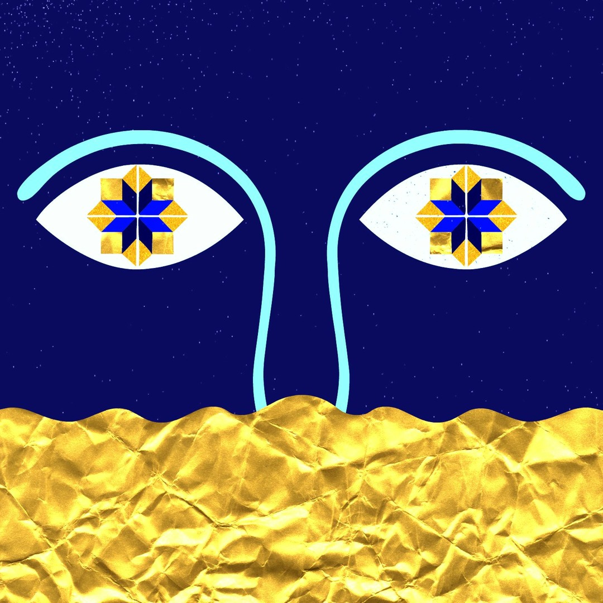

# 🌊 Unidad 6: Agentes Autónomos

**Texto Guia:** Capítulo 5 - Autonomous Agents [The Nature of Code](https://natureofcode.com/autonomous-agents/)
**Herramienta de desarrollo:** three.js / JavaScript

## 📌 Actividad 01: Referentes

- 📹[Agentes autónomos — The Nature of Code](https://natureofcode.com/autonomous-agents/)
- 📹[Steering Behaviors for Autonomous Characters — Craig Reynolds](https://www.red3d.com/cwr/papers/1999/gdc99steer.pdf)
- 📹[Referente para explorar flow fields.](https://editor.p5js.org/juanferfranco/full/FDhBzlroM)
- 📹[Flow Fields — Tyler Hobbs](https://www.tylerxhobbs.com/words/flow-fields)
- 📹[https://threejs.org/examples/?q=birds](https://threejs.org/examples/?q=birds)

## 📌 Actividad 02: explorar Interactive Physarum

- 📹[Interactive Physarum de Bleuje](https://github.com/Bleuje/interactive-physarum)

## 📌 Actividad 03: Encargo de diseño

Me gusta mucho las visuales de esta cancion me parecio sencilla de interpretar, primero queria implementar otra cancion llamada pankobabaunka pero al ser tan dificil de aterrizar mi idea opte por una cancion mas literal.

[Azul Oro](https://youtu.be/U9mZC3o8Ia4)
[Pankobabaunka](https://youtu.be/jnKhwYKmNjM)

## [Enlace del Demo](https://alafresh.github.io/Instrumento_Visual_Pankobabaunka/)

# Autoevaluación de Instrumento Visual Interactivo

| Criterio / Dimensión              | Descripción                                                                                                                                                                                                                | Puntaje Máximo | Autoevaluación |
| --------------------------------- | -------------------------------------------------------------------------------------------------------------------------------------------------------------------------------------------------------------------------- | -------------- | -------------- |
| **1. Cumplimiento del encargo**   | El instrumento utiliza tecnología WebGL/HTML5 en tiempo real, logra un rendimiento fluido a pantalla completa y permite interpretar visualmente la pieza musical elegida (_Azul Oro_).                                     | 25 pts         | 25 pts         |
| **2. Comprensión y verificación** | Capacidad de explicar la arquitectura del sistema (sensores de los agentes, mapa de rastro difuso, matriz WebGL), predecir el impacto de variables (velocidad, relieve, memoria) y verificar los cambios en tiempo real.   | 25 pts         | 25 pts         |
| **3. Diseño e intención**         | Justificación estética y técnica de los comportamientos algorítmicos (modos de fondo/pincel, cambio de paleta a tonos de azul y propagación de rastro oro) en función de la dinámica de la pieza musical.                  | 25 pts         | 25 pts         |
| **4. Interpretación humana**      | La estructura de controles e interactividad (clic izquierdo/derecho, teclado para parámetros y gestión de estados) permite conducir el sistema de forma fluida y responder en tiempo real al comportamiento del algoritmo. | 25 pts         | 25 pts         |
| **TOTAL**                         | **Evaluación global sobre base de 100 puntos**                                                                                                                                                                             | **100 pts**    | **100 pts**    |

---

> **Nota final autoevaluada:** **5.0 / 5.0**
